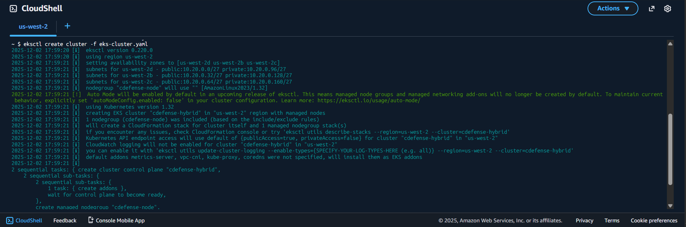

# EKS Cluster Setup for CloudDefense Hybrid

This guide walks you through creating an Amazon EKS cluster with one managed node for running CloudDefense scan jobs.

## Prerequisites

- **AWS Account** with appropriate permissions
- **AWS CLI** installed and configured
- **kubectl** installed

## Step 1: Install eksctl

eksctl is a CLI tool for creating and managing EKS clusters. Install it based on your operating system:

### Windows (using Chocolatey)
```powershell
choco install eksctl
```

### Linux
```bash
curl --silent --location "https://github.com/weaveworks/eksctl/releases/latest/download/eksctl_$(uname -s)_amd64.tar.gz" | tar xz -C /tmp
sudo mv /tmp/eksctl /usr/local/bin
```

### macOS (using Homebrew)
```bash
brew tap weaveworks/tap
brew install weaveworks/tap/eksctl
```

Verify the installation:
```powershell
eksctl version
```

## Step 2: Install kubectl

kubectl is the Kubernetes command-line tool:

### Windows
```powershell
choco install kubernetes-cli
```

### Linux
```bash
curl -LO "https://dl.k8s.io/release/$(curl -L -s https://dl.k8s.io/release/stable.txt)/bin/linux/amd64/kubectl"
sudo install -o root -g root -m 0755 kubectl /usr/local/bin/kubectl
```

### macOS
```bash
brew install kubectl
```

Verify:
```powershell
kubectl version --client
```

## Step 3: EKS Cluster Configuration

Create a file named `eks-cluster-config.yaml` with the following configuration:

```yaml
apiVersion: eksctl.io/v1alpha5
kind: ClusterConfig

metadata:
  name: cdefense-hybrid
  region: us-west-2

vpc:
  cidr: 10.20.0.0/16

managedNodeGroups:
  - name: cdefense-node
    availabilityZones: ["us-west-2a"]
    instanceTypes: ["t3.medium"]
    desiredCapacity: 1
    minSize: 1
    maxSize: 2
    volumeEncrypted: true
    privateNetworking: true
    disableIMDSv1: true
    iam:
      withAddonPolicies:
        autoScaler: true
    tags:
      k8s.io/cluster-autoscaler/enabled: "true"
      k8s.io/cluster-autoscaler/cdefense-hybrid: "owned"
      Owner: "CloudDefense"
```

### Configuration Explained:

- **Cluster Name**: `cdefense-hybrid` - The name of your EKS cluster
- **Region**: `us-west-2` - AWS region where the cluster will be created
- **VPC CIDR**: `10.20.0.0/16` - IP range for the cluster VPC
- **Node Group**: `cdefense-node` - Name of the worker node group
- **Instance Type**: `t3.medium` - EC2 instance type for worker nodes
- **Capacity**: 1 node (can scale up to 2)
- **Availability Zone**: `us-west-2a` - Single AZ for cost optimization
- **Volume Encryption**: Enabled for EBS volumes
- **Private Networking**: Nodes in private subnets
- **IMDSv1**: Disabled for enhanced security (only IMDSv2 allowed)

## Step 4: Create the EKS Cluster

Run the following command to create the cluster:

```powershell
eksctl create cluster -f eks-cluster-config.yaml
```


**Important Notes:**
- This process takes approximately **15-20 minutes**
- eksctl will automatically configure kubectl context
- Progress will be displayed in the terminal

## Step 5: Verify Cluster Creation

After the cluster is created, verify it's working correctly:

### Check Cluster Status
```powershell
eksctl get cluster --name cdefense-hybrid --region us-west-2
```

### Verify Nodes
```powershell
kubectl get nodes
```

Expected output:
```
NAME                                           STATUS   ROLES    AGE   VERSION
ip-10-20-x-x.us-west-2.compute.internal        Ready    <none>   3m    v1.28.x
```

### Check System Pods
```powershell
kubectl get pods -n kube-system
```

You should see pods for CoreDNS, kube-proxy, and AWS VPC CNI running.

### Get Cluster Information
```powershell
# Get cluster endpoint
aws eks describe-cluster --name cdefense-hybrid --region us-west-2 --query "cluster.endpoint" --output text

# Get VPC ID
aws eks describe-cluster --name cdefense-hybrid --region us-west-2 --query "cluster.resourcesVpcConfig.vpcId" --output text

# Get security group
aws eks describe-cluster --name cdefense-hybrid --region us-west-2 --query "cluster.resourcesVpcConfig.clusterSecurityGroupId" --output text
```

## Useful Commands

```powershell
# Update kubeconfig (if needed)
aws eks update-kubeconfig --name cdefense-hybrid --region us-west-2

# Get node group information
eksctl get nodegroup --cluster=cdefense-hybrid --region us-west-2

# Scale node group
eksctl scale nodegroup --cluster=cdefense-hybrid --name=cdefense-node --nodes=2 --region us-west-2

# Delete cluster (when no longer needed)
eksctl delete cluster --name cdefense-hybrid --region us-west-2
```

## Next Steps

Once the EKS cluster is created, proceed with the main CloudDefense Hybrid setup as described in [README.md](./README.md).

Note: See [EKS-CTL-Resources.md](./EKS-CTL-Resources.md) for details on the resources provisioned by eksctl.