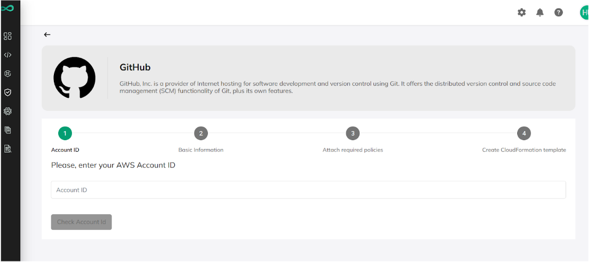
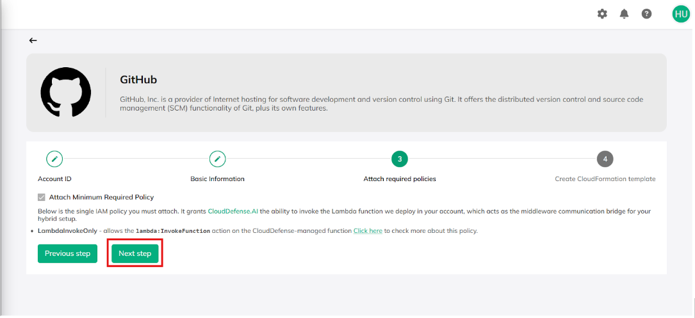
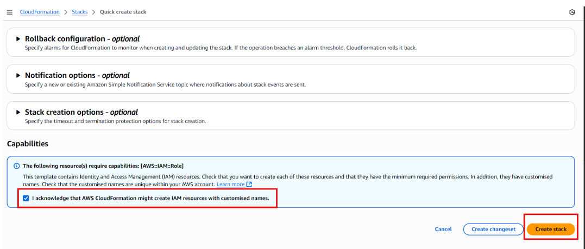
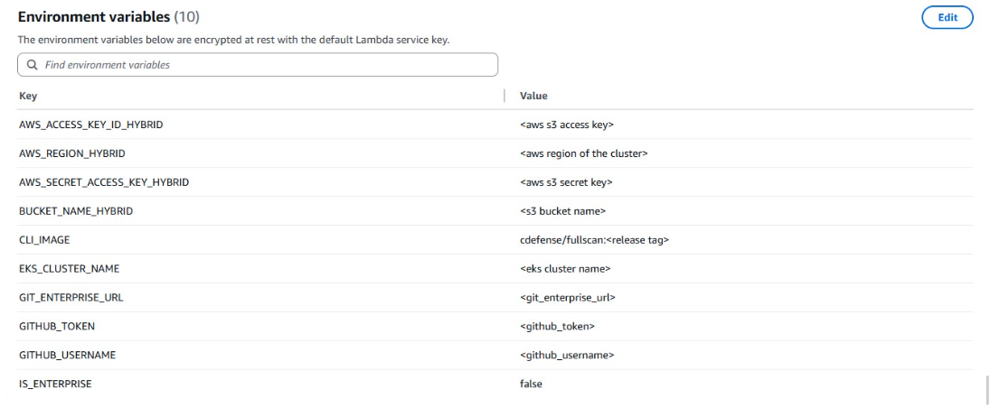
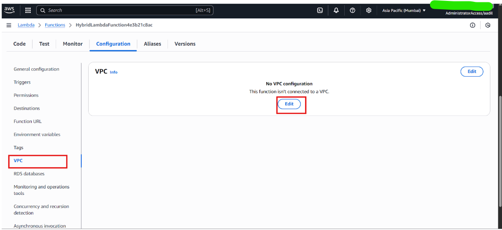
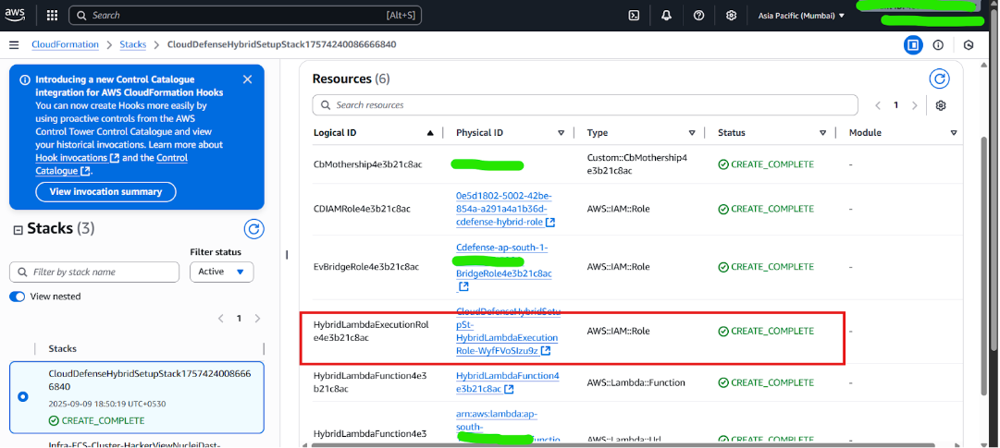
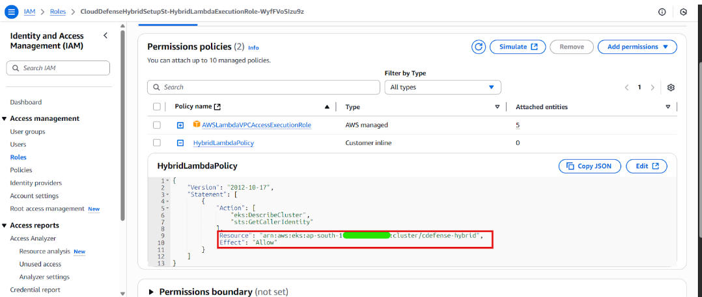

# Qina-Hybrid Setup in AWS Cloud
Qina Hybrid setup for Code Scanning.

### Pre-requisites

- **AWS Account**: An AWS account with permissions to create CloudFormation stacks, Lambda functions, and IAM roles.
- **EKS Cluster**: An Amazon EKS cluster with one node to run scan jobs. See [EKS Cluster Setup Guide](./EKS_CLUSTER_SETUP.md) for detailed instructions.
- **IAM Permissions**: The CloudFormation setup creates an IAM role that establishes a trust relationship with the CloudDefense AWS account (`arn:aws:iam::407638845061:root`). This role grants CloudDefense `sts:AssumeRole` and `lambda:InvokeFunction` permissions, allowing it to securely trigger scans in your environment.
- The CloudDefense Portal account will be created on the call, as it must be provisioned by the CloudDefense team.
- **GitHub/GitLab Personal Access Token (PAT)**: A token with the correct scopes to allow cloning and analyzing repositories.
  - **GitHub**: The PAT must have the full `repo` scope. See [How to Create a GitHub PAT](./GITHUB_PAT_CREATION.md).
  - **GitLab**: The PAT must have `read_repository` and `read_api` scopes. See [How to Create a GitLab PAT](./GITLAB_PAT_CREATION.md).
 


## 1. Go Integration Setup and CloudFormation Creation

### Initial Setup in CloudDefense Dashboard

1. In the CloudDefense dashboard, navigate to **Integration → GitHub**.
2. Fill in the required details (AWS account number). 
   > **Note**: Do not fill GitHub token here directly.

3. Select the Region in which you have the cluster and want to create the Lambda.

4. Click **Create CloudFormation template** button.
5. Acknowledge that AWS CloudFormation will create resources and click **Create Stack**.

Wait for the CloudFormation stack to complete successfully before proceeding to the next steps.
> **Note**: External ID will be generated randomly and will go in the CloudFormation template.
CloudDefense Account Id will be hardcoded and customer account id will be dynamic.


## 2. Lambda Configuration and Scanner Image Setup

After CloudFormation completes, a Lambda function will be created. Perform the following updates:

### Environment Variables

Configure the following environment variables in your Lambda function:

| Variable | Description |
|----------|-------------|
| `EKS_CLUSTER_NAME` | Your Kubernetes cluster name |
| `GITHUB_USERNAME/GITLAB_USERNAME` | Your GitHub or GitLab username |
| `GITHUB_TOKEN/GITLAB_TOKEN` | Your GitHub or GitLab token. See [How to Create a GitHub PAT](./GITHUB_PAT_CREATION.md) and [How to Create a GitLab PAT](./GITLAB_PAT_CREATION.md) for detailed instructions. |
| `AWS_REGION_HYBRID` | AWS region of the cluster |
| `AWS_ACCESS_KEY_ID_HYBRID` | AWS S3 access key |
| `AWS_SECRET_ACCESS_KEY_HYBRID` | AWS S3 secret key |
| `BUCKET_NAME_HYBRID` | AWS S3 bucket name |
| `CLI_IMAGE` | Cdefense CLI scanner image (`cdefense/fullscan:latest`) |
| `IS_ENTERPRISE` | Set to `false` |
| `GIT_ENTERPRISE_URL` | Your Source GIT enterprise URL |


## 3 Networking Configuration

### Attach Lambda to EKS Cluster VPC

Configure the Lambda function to use the same VPC as the cdefense-hybrid EKS cluster for resource access. Select two private subnets from different Availability Zones and the cluster's security group for optimal availability and security.

#### Required Steps

1. In Lambda configuration, select VPC from the left sidebar and click Edit.



2. Get VPC ID via AWS CLI:
```bash
aws eks describe-cluster --name cdefense-hybrid --region us-west-2 --query "cluster.resourcesVpcConfig.vpcId" --output text
```

3. Select this VPC.

4. Choose 2 private subnets from different Availability Zones.


5. Get EKS cluster security group:
```bash
aws eks describe-cluster --name cdefense-hybrid --region us-west-2 --query "cluster.resourcesVpcConfig.clusterSecurityGroupId" --output text
```

6. Add this security group.

7. Click Save to apply changes.

## Optional Steps

These are not needed if using the EKS-provisioned VPC and security group.

- Select Lambda security group and allow outbound HTTPS (port 443) to EKS control plane or EKS security group.
- Ensure Lambda internet access via NAT Gateway in public subnet; route 0.0.0.0/0 through it in private subnet route table.
- In EKS security group, add inbound rule for port 443 with Lambda security group as source.
## 4. IAM Role Updates

1. Go to the IAM Role created by CloudFormation (e.g., `CloudDefenseHybridSetupSt-HybridLambdaExecutionRole-*`).

2. Edit the inline policy to update the cluster ARN with your own.


## 5. Kubernetes Access Setup

1. Log in to the Kubernetes cluster that will be used for running jobs.
2. Run the following command:
   ```bash
   kubectl edit configmap aws-auth -n kube-system
   ```
3. Add a new group entry to provide the Lambda role access:
   ```yaml
   - groups:
     - system:masters
     rolearn: arn:aws:iam::1234567890:role/CloudDefenseHybridSetupSt-HybridLambdaExecutionRole*
   ```
   > **Note**: Use the role ARN dynamically created from CloudFormation
4. Save and exit the editor.

## 6. Add Image Secret

To pull the private full scan image, create a Docker registry secret:

```bash
kubectl create secret docker-registry image-secret \
  --docker-server=https://index.docker.io/v1/ \
  --docker-username=YOUR_DOCKERHUB_USERNAME \
  --docker-password=YOUR_DOCKERHUB_PASSWORD \
  --docker-email=YOUR_EMAIL \
  -n default
```

## 7. Verify the Secret

Confirm that the secret has been added successfully:

```bash
kubectl get secrets
kubectl describe secret image-secret
```

✅ **Setup Complete**: At this point, the Lambda function will have network access and RBAC permissions to run jobs on the Kubernetes cluster.

---

## Scanner Job Information

The `CLI_IMAGE` environment variable stored in the Lambda function contains the scanner, which is a code-analysis utility that automatically runs:

- **SAST** (Static Application Security Testing)
- **SCA** (Software Composition Analysis)
- **Secrets Detection**

Once the repository is cloned, the scanner inspects the source code for security flaws, dependency vulnerabilities, and exposed secrets.

## Metadata Reporting to QINA

After completing a scan, the tool generates structured metadata and sends it to the QINA backend. This metadata provides both a high-level overview and detailed examples of detected issues.

### Example Metadata

```json
{
  "summary": {
    "total_vulnerabilities": 8,
    "critical": 6,
    "high": 2,
    "medium": 0,
    "low": 0,
    "affected_file": "/app/a.py",
    "affected_lines": [28, 46],
    "main_issue": "SQL Injection via untrusted user input (request.args.get('username'))",
    "sink": "cursor.execute(query)"
  },
  "example_vulnerability": {
   "rule_id": "flask-prestodb-sqli",
    "severity": "CRITICAL",
    "description": "Untrusted input might be used to build a database query, which can lead to a SQL injection vulnerability. An attacker can execute malicious SQL statements and gain unauthorized access to sensitive data, modify, delete data, or execute arbitrary system commands. To prevent this vulnerability, use prepared statements and parameterized queries.",
    "file": "/app/a.py",
    "line": 28,
    "code_snippet": "cursor.execute(query)",
    "taint_source": "request.args.get('username')",
    "cwe": "CWE-89: SQL Injection",
    "references": [
      "https://owasp.org/Top10/A03_2021-Injection"
    ],
    "technology_stack": [
      "flask",
      "flask-wtf",
      "prestodb",
      "python",
      "web",
      "wtforms"
    ]
  }
}
```


